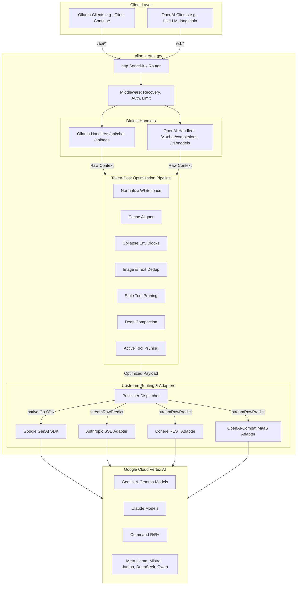

# cline-vertex-gw

[](https://goreportcard.com/report/github.com/f0o/cline-vertex-gw)
[](https://github.com/f0o/cline-vertex-gw/actions)
[](LICENSE)

An ultra-high-performance, production-grade, dual-surface translation proxy that connects Ollama-compatible and OpenAI-compatible clients to Google Cloud Vertex AI. 

Built specifically for high-frequency AI agent developer loops (such as Cline), the gateway implements an advanced, multi-stage **Token-Cost Optimization Pipeline** to dramatically shrink prompt contexts, maximize KV caching, detect and break LLM execution loops, and save up to **75% in upstream API costs**.

---

## Architecture Overview

`cline-vertex-gw` is a stateless translation gateway written in pure Go. It translates request/response shapes on-the-fly and processes streams dynamically with zero added buffering latency.



---

## Key Features

### 1. Dual-Dialect Translation Surface
- **OpenAI Dialect (`/v1/*` - Highly Recommended):** The primary and most feature-rich translation layer. Exposes `/v1/models` and `/v1/chat/completions` with bearer-token authentication. This shim is **architecturally superior** to the Ollama endpoint:
  - **Superior Streaming Tool Calling:** Streams function call arguments token-by-token in real-time, allowing clients to show tool calls dynamically.
  - **Real-Time Stream Usage:** Emits standard usage metric blocks on the final stream chunk for precise billing tracking.
  - **Ecosystem Compatibility:** Plugs natively and robustly into LiteLLM, langchain, standard OpenAI SDKs, Continue, and Cline's OpenAI Compatible provider.
- **Ollama Dialect (`/api/*` - Compatibility Fallback):** Seamless model discovery (`/api/tags`) and streaming chat completions (`/api/chat`). Maintained for backward compatibility as a drop-in replacement for standard local Ollama instances (tool calls are assembled fully and emitted on the final `Done` frame).

### 2. Multi-Stage Token-Cost Optimization
The gateway executes a sequential, 12+ stage prompt optimization pipeline prior to upstream dispatch:
- **Whitespace Normalization (`GW_NORMALIZE_WHITESPACE`):** Strips redundant carriage returns, double-spaces, and trailing empty lines from system/user messages.
- **Prefix Cache Stabilization (`GW_CACHE_ALIGNER`):** Isolates highly volatile runtime variables (such as dynamic date/time strings, temporary session UUIDs, and absolute working directories) and relocates them to the system prompt suffix. This ensures the massive system instruction and tool schema prefix remains 100% stable, guaranteeing up to **90% prompt-cache hit rates** on Anthropic Claude and Gemini.
- **Environment Block Collapse (`GW_COLLAPSE_ENV_BLOCKS`):** Detects massive system environment paste-ins (like shell variables or directory structures) and collapses them down to a summary if they exceed size thresholds.
- **Lossless Compress-Cache-Retrieve (CCR) Loops:** Overhauls tool result truncation and history compaction. When massive terminal outputs are elided, high-density placeholders carrying SHA-256 hashes are substituted. A dynamically injected, locally intercepted `retrieve_elided_content` tool allows the model to retrieve the full, raw files from a local file-based cache on-demand.
- **Active Tool Pruning (`GW_ACTIVE_TOOL_PRUNING`):** Analyzes recent conversation turns and dynamically disables unused tool schemas from the model's active schema catalog to trim active token weights.
- **Runaway Loop Protection (`GW_BREAK_LOOP_TRAP`):** A high-performance, 0 B/op loop detector watches the streaming output. If a repetitive, infinite tool-calling loop is detected, it cancels the connection, saving hundreds of dollars in automated runtime bills.

### 3. Comprehensive Multimodal & Media Sniffing
- **Magic-Bytes Sniffer (`sniffMediaMIME`):** Automatically detects file types (PNG, JPEG, GIF, WebP, PDF, WAV, MP3, MP4, etc.) from base64 streams without relying on client-supplied MIME hints.
- **Upstream Guardrails:** Validates media types at the gate to prevent mid-turn HTTP failures. Informs clients immediately with clean `400 Bad Request` payloads if a publisher does not support a specific format (e.g., sending a video to Claude).
- **Polymorphic Audio & Native PDFs:** Maps advanced OpenAI `input_audio` payloads and transforms PDF documents into native Claude `document` blocks transparently.
- **Bandwidth Saving via Deduplication:** Hashes image attachments; subsequent identical images in the chat history are replaced with lightweight pointer references to the original turn.

### 4. Fully Translated Tool Calling
- Seamlessly bridges standard client tool calling formats with specialized upstream protocols:
  - **Inbound:** Maps client `tools` schemas, `tool_choice` modifiers, and previous turn `tool_calls` / `tool` responses to upstream shapes. Supports flattening schema parameters for Cohere and formatting Gemini Function Declarations.
  - **Outbound:** Stream-assembles upstream function chunk-by-chunk and emits clean, standardized OpenAI `delta.tool_calls` or Ollama-native function objects on-the-fly.

### 5. Production Observability & Diagnostics
- **Prometheus Metrics:** Exposes a high-fidelity, unauthenticated `/metrics` endpoint with latency histograms, active compression bytes saved, loop-detector trigger counts, and API retry rates.
- **Live Pricing Scraper (`GW_PRICING`):** Automatically pages through GCP's public Billing Catalog API at startup to resolve active SKU pricing. Calculates and prints exact per-request USD costs in standard logs.
- **Dynamic Routing Tiers:** Honors client-supplied `X-Routing-Tier` headers to dynamically configure standard, priority, or highly discounted flex/batch upstream routing.

---

## Configuration Variables

The gateway is configured exclusively through environment variables.

### General Server Settings

| Variable | Default | Purpose / Constraints |
|---|---|---|
| `PORT` | `11434` | TCP port to listen on. |
| `BIND_ADDR` | `127.0.0.1` | Network interface to bind. Use `0.0.0.0` in Docker (automatically overridden in our image). |
| `GOOGLE_CLOUD_PROJECT` | _required_ | Google Cloud Project ID. |
| `GOOGLE_CLOUD_LOCATION` | _required_ | Google Cloud regional location (e.g., `us-central1`, `us-east5`, `europe-west4`). |
| `GATEWAY_AUTH_TOKEN` | _empty_ | Bearer token to protect endpoints. Highly recommended when exposing the port. |
| `MAX_REQUEST_MB` | `16` | Hard cap on incoming HTTP request body size (in MiB) to prevent memory exhaustion. |
| `LOG_LEVEL` | `info` | Logging verbosity: `debug` \| `info` \| `warn` \| `error`. |
| `LOG_FORMAT` | `json` | Logging layout format: `json` (structured) \| `text` (human-readable). |
| `GW_TAGS_CACHE_TTL_SEC` | `60` | TTL in seconds for the in-memory `/api/tags` and `/v1/models` discovery cache. |

### Token-Cost Optimization Settings (`GW_PROFILE` Master Toggle)

Setting the `GW_PROFILE` environment variable configures baseline parameters across **5 progressive optimization levels**. Individual `GW_*` settings can still be declared to override specific parameters.

| Profile Name | `GW_PROFILE` Value | Description |
|---|:---:|---|
| **Pass-Through (Raw)** | `passthrough` \| `raw` \| `1` | Disables all prompt modifications. Raw user input is passed upstream. |
| **Gentle** | `gentle` \| `conservative` \| `2` | Minimal non-destructive changes: whitespace normalization and prefix cache alignment. |
| **Balanced (Default)** | `balanced` \| `default` \| `3` | Optimal compromise of context reductions, loop protections, and whitespace savings. |
| **Aggressive** | `aggressive` \| `4` | Actively compacts history, collapses system environment blocks, and prunes stale read-only tool logs. |
| **Extreme Squeeze** | `extreme` \| `squeeze` \| `5` | Maximizes prompt shrinkage: tiny truncations, aggressive active tool pruning, and strict size constraints. |

#### Detailed Optimization Parameter Map

| Parameter / Knob | Standard Default | Fallback Env Alias | Gentle (2) | Balanced (3) | Aggressive (4) | Extreme (5) |
|---|:---:|---|:---:|:---:|:---:|:---:|
| `GW_NORMALIZE_WHITESPACE` | `on` | — | `on` | `on` | `on` | `on` |
| `GW_CACHE_ALIGNER` | `on` | — | `on` | `on` | `on` | `on` |
| `GW_BREAK_LOOP_TRAP` | `on` | — | `on` | `on` | `on` | `on` |
| `GW_LOOP_TRAP_NUDGE` | `on` | — | `off` | `on` | `on` | `on` |
| `GW_COLLAPSE_ENV_BLOCKS` | `on` | — | `on` | `on` | `on` | `on` |
| `GW_COLLAPSE_ENV_MIN_BYTES` | `256` | `GW_COLLAPSE_ENV_THRESHOLD` | `1024` | `256` | `128` | `64` |
| `GW_DEDUP_REPLAY` | `on` | — | `on` | `on` | `on` | `on` |
| `GW_DEDUP_MIN_BYTES` | `512` | `GW_DEDUP_THRESHOLD` | `1024` | `512` | `256` | `128` |
| `GW_DEDUP_SUBSTRING` | `off` | — | `off` | `off` | `on` | `on` |
| `GW_DEDUP_SUBSTRING_MIN_BYTES`| `1024` | `GW_DEDUP_SUBSTRING_THRESHOLD`| `1024` | `1024` | `512` | `256` |
| `GW_TOOL_RESULT_TRUNCATE` | `on` | — | `off` | `on` | `on` | `on` |
| `GW_TOOL_RESULT_MAX_BYTES` | `8000` | `GW_TOOL_TRUNCATE_LIMIT` | `8000` | `8000` | `4096` | `2048` |
| `GW_PRUNE_STALE_TOOLS` | `off` | — | `off` | `off` | `on` | `on` |
| `GW_DEEP_COMPACT` | `off` | — | `off` | `off` | `on` | `on` |
| `GW_DEEP_COMPACT_KEEP_TURNS` | `12` | — | `12` | `12` | `12` | `8` |
| `GW_DEEP_COMPACT_MAX_BYTES` | `500` | — | `500` | `500` | `500` | `250` |
| `GW_ACTIVE_TOOL_PRUNING` | `off` | — | `off` | `off` | `on` | `on` |
| `GW_ACTIVE_TOOL_PRUNING_WINDOW`| `20` | — | `20` | `20` | `20` | `10` |
| `GW_MAX_INPUT_CHARS` | `0` (unlim) | — | `0` | `0` | `0` | `350000` |

---

## Active Prometheus Metrics

The gateway exposes high-fidelity runtime metrics on `GET /metrics`:

| Metric Name | Type | Labels | Description |
|---|---|---|---|
| `cline_vertex_gw_build_info` | Gauge | `version` | Confirms gateway version. |
| `cline_vertex_gw_requests_total` | Counter | `route`, `status` | Total HTTP requests handled. |
| `cline_vertex_gw_request_duration_seconds` | Histogram | `route` | Response latency by endpoint. |
| `cline_vertex_gw_upstream_tokens_total` | Counter | `kind`, `model` | Total tokens billed (`prompt`, `cached`, `completion`). |
| `cline_vertex_gw_upstream_retries_total` | Counter | `class` | Spikes in upstream retry states. |
| `cline_vertex_gw_upstream_loop_detector_fired_total`| Counter | — | Runaway LLM loop terminations. |
| `cline_vertex_gw_tags_cache_hits_total` | Counter | — | Model discovery tags cache hits. |
| `cline_vertex_gw_tags_cache_misses_total` | Counter | — | Model discovery tags cache misses. |
| `cline_vertex_gw_panics_recovered_total` | Counter | — | Number of recovered runtime crashes. |
| `cline_vertex_gw_compression_bytes_saved_total` | Counter | `stage` | Bytes stripped by specific pipeline stage. |
| `cline_vertex_gw_estimated_cost_usd_total` | Counter | `kind`, `model`, `tier` | Total accumulated cost spent (GCP Catalog rates). |

---

## Quick Start

### Prerequisites
1. **GCP Project:** Ensure you have an active Google Cloud Project with the Vertex AI API enabled.
2. **Credentials:** Authenticate your local machine using Application Default Credentials (ADC):
   ```bash
   gcloud auth application-default login
   ```

### 1. Run via Docker
To run locally on Ollama's standard port `11434`:
```bash
docker run -d \
  -p 11434:11434 \
  -v ~/.config/gcloud:/root/.config/gcloud:ro \
  -e GOOGLE_CLOUD_PROJECT="your-project-id" \
  -e GOOGLE_CLOUD_LOCATION="us-central1" \
  ghcr.io/f0o/cline-vertex-gw:latest
```

### 2. Connect Cline
1. Open Cline's settings pane inside VS Code.
2. Under **API Provider**, select **Ollama**.
3. Set the **Ollama Base URL** to `http://localhost:11434`.
4. The **Model** picker will automatically populate with all supported and enabled Vertex AI models (including Gemini, Anthropic Claude, Meta Llama, Mistral, and more). Select your desired model and begin coding!

---

## Technical Development & Compilation

To compile or test the project locally, you need Go installed.

```bash
# Build the binary locally (injects current Git version string)
make build

# Run linting and static checks
make vet

# Run the complete test suite with race-detection enabled
make test
```

For more detailed deployment configurations, operations manuals, and API details, check out the comprehensive [Documentation Site](https://f0o.github.io/cline-vertex-gw).

---

## License

`cline-vertex-gw` is licensed under the MIT License. See [LICENSE](LICENSE) for details.
