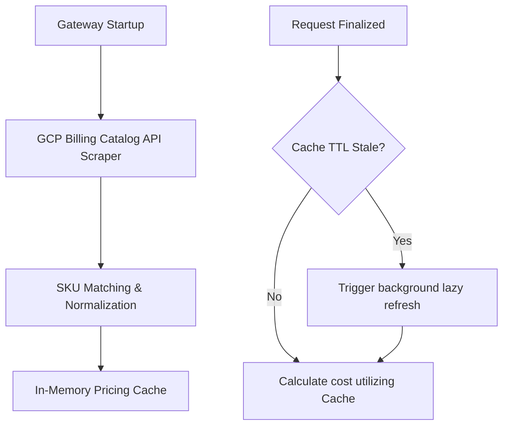

# Cost Estimation & Routing Tiers

`cline-vertex-gw` includes an automated, live pricing tracker and cost calculation subsystem to help operators monitor and control cloud API expenses in real-time.

---

## 1. Real-Time Cost Calculation

When `GW_PRICING` is active (enabled by default), the gateway computes an estimated USD cost for every completion request. This calculation is printed in your logs immediately following request execution statistics:

```text
2026-06-10T12:42:00.000Z INFO cost estimate phase=chat-stream model=claude-3-5-sonnet total_usd=0.012063 input_usd=0.001875 cached_usd=0.005270 output_usd=0.004918 input_per_mtok=1.250 cached_per_mtok=0.310 output_per_mtok=10.000 src="Vertex AI"
```

### Key Cost Log Parameters
- **`total_usd`:** Cumulative calculated cost of the transaction.
- **`input_usd`:** Cost of standard prompt tokens.
- **`cached_usd`:** Discounted cost of prompt-cached input tokens.
- **`output_usd`:** Cost of generation tokens.
- **`input_per_mtok` / `cached_per_mtok` / `output_per_mtok`:** Active billing rates resolved per **1 million tokens** in USD.
- **`src`:** Billing lookup source (e.g. `"Vertex AI"`).

---

## 2. Live Price Scraping Engine

To prevent static pricing tables from drifting out of date as cloud providers alter rates, `cline-vertex-gw` utilizes a fully automated price scraping engine:



### Operational Mechanics
1. **Startup Scraping:** On launch, the gateway queries the public GCP Cloud Billing Catalog API (`cloudbilling.googleapis.com`), paging through all active Vertex-related SKUs.
2. **SKU Matching:** The scraper resolves SKU text descriptions (such as `"Gemini 1.5 Flash input tokens"` or `"Claude 3.5 Sonnet output tokens"`) and maps them directly to model prefixes.
3. **Cache Storage:** Discovered rates are normalized to USD per 1M tokens and stored in a thread-safe in-memory cache.
4. **Lazy Refreshing:** The cache is lazily refreshed in the background after every `GW_PRICING_CACHE_TTL_SEC` (default: 6 hours) on request completion. This avoids active latency during live request processing.

---

## 3. Pricing Considerations & Caveats

- **Free-Tier API:** The pricing scraper uses public endpoints and requires no GCP API keys. If permissions fail (e.g., due to local firewall restrictions or strict GCP catalog blocks), the gateway gracefully logs a warning and disables pricing without interrupting chat or model-discovery requests.
- **SKU Resolution Guard:** If a model's SKU description cannot be matched with 100% confidence, the log prints `cost=unavailable` and the transaction is omitted from the `cline_vertex_gw_estimated_cost_usd_total` metric to prevent incorrect reporting.
- **Base Pricing Baseline:** The scraper models rates against base input tiers. Long-context premium surcharge tiers are not currently modeled.
- **Character Surcharges:** For older legacy character-billed models, token sizes are mathematically approximated to estimate sub-cent cost values.
- **Disabling:** Set `GW_PRICING=off` to completely disable the price catalog scraper, removing cost calculations and metrics.

---

## 4. Dynamic Routing & Pricing Tiers

Workloads have varying urgency and SLA requirements. `cline-vertex-gw` permits clients to dynamically select GCP's upstream routing and pricing tiers on a per-request basis.

### Client Configuration Headers
The gateway parses incoming HTTP headers in order of precedence:
1. `X-Routing-Tier`
2. `X-Vertex-AI-Routing-Tier`

Headers are evaluated case-insensitively and normalized into one of three supported Vertex AI routing tiers:

| Normalized Tier | Client Header Value | Upstream Behavior & Cost |
|---|---|---|
| **Standard** | `standard` (or empty/invalid) | Routed through standard Vertex AI execution SLA. Standard baseline rates apply. |
| **Priority** | `priority` | Higher SLA priority, lower latency, and raised quota thresholds for high-volume agent loops. |
| **Flex / Batch** | `flex`, `batch`, `flex/batch` | Non-urgent queries. Routed at highly discounted rates (often up to 50% discount) when processed in batch schedules. |

### Downstream Propagation
Once normalized, the gateway automatically injects the resolved tier into the outbound request headers via `X-Vertex-AI-Routing-Tier`. This ensures that standard Google SDK, Anthropic raw REST, and OpenAI-compatible endpoints all execute under the correct routing tier.
