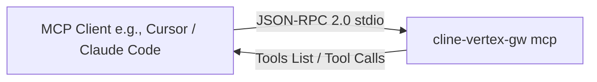

# Model Context Protocol (MCP) Server

The **Model Context Protocol (MCP) Server** is a system integration feature of `cline-vertex-gw`. It implements the standard, open-source Model Context Protocol (MCP) created by Anthropic, enabling MCP-compatible clients (like Cursor, Cline, and Claude Code) to use our high-performance prompt compression and lossless retrieval cache directly.

---

## How It Works

Instead of routing your entire API traffic through `cline-vertex-gw`'s HTTP proxy endpoint, clients can launch the gateway natively in the background as an **MCP Server** over standard input/output (stdio).

The MCP server handles incoming JSON-RPC 2.0 requests over stdio and responds over stdout:



All standard error logs and debug diagnostics are routed to `os.Stderr` to prevent corrupting the standard stdout JSON-RPC stream, satisfying the strict requirements of the MCP specification.

---

## Exposed MCP Tools

The MCP Server exposes two powerful, high-performance tools to connected clients:

### 1. `compress_prompt`
*   **Description**: Aggressively compresses raw prompts, logs, or file pastes using our advanced, Go-native 12-stage compression pipeline (structured JSON smart-crushing, whitespace normalization, code syntactic compression, etc.).
*   **Input Schema**:
    *   `prompt` (string, required): The raw text, code block, or JSON body to compress.
*   **Returns**: The fully compressed text.

### 2. `retrieve_original`
*   **Description**: Retrieves the original, uncompacted content of a previously truncated/elided historical turn or tool response from the gateway's fast on-disk `FSCache` using its SHA-256 hash.
*   **Input Schema**:
    *   `hash` (string, required): The cryptographic hex SHA-256 hash from the elision placeholder (e.g., `hash=f83a...`).
*   **Returns**: The original, raw text.

---

## Quickstart & Installation

To run the gateway as an MCP server, pass the **`mcp`** subcommand when executing the compiled binary:

```bash
# Compile the binary
go build ./cmd/cline-vertex-gw

# Run the MCP server
./cline-vertex-gw mcp
```

### 1. Configuration in Claude Desktop
To integrate with the official Anthropic Claude Desktop client, add the following configuration to your `claude_desktop_config.json`:

```json
{
  "mcpServers": {
    "cline-vertex-gw": {
      "command": "/absolute/path/to/cline-vertex-gw",
      "args": ["mcp"],
      "env": {
        "GW_PROFILE": "balanced",
        "GW_CACHE_DIR": "/absolute/path/to/cache"
      }
    }
  }
}
```

### 2. Configuration in Cursor
1.  Go to **Cursor Settings** > **Features** > **MCP**.
2.  Click **+ Add New MCP Server**.
3.  Fill in the form:
    *   **Name**: `cline-vertex-gw`
    *   **Type**: `stdio`
    *   **Command**: `/absolute/path/to/cline-vertex-gw mcp`

### 3. Configuration in Cline (VS Code)
1.  Open the Cline sidebar in VS Code.
2.  Go to **MCP Settings**.
3.  Add the new stdio command:
    ```
    /absolute/path/to/cline-vertex-gw mcp
    ```

---

## Technical Advantages

*   **Sub-Millisecond Processing**: Built in pure Go, the JSON-RPC parsing, structured array walk, and string operations execute in **under 1ms**, adding virtually zero latency to your agentic loops.
*   **Zero Dependencies**: Unlike Python or Node-based MCP implementations, the `cline-vertex-gw` binary runs as a standalone static executable with no node_modules, Python runtimes, or ML package sidecars required.
