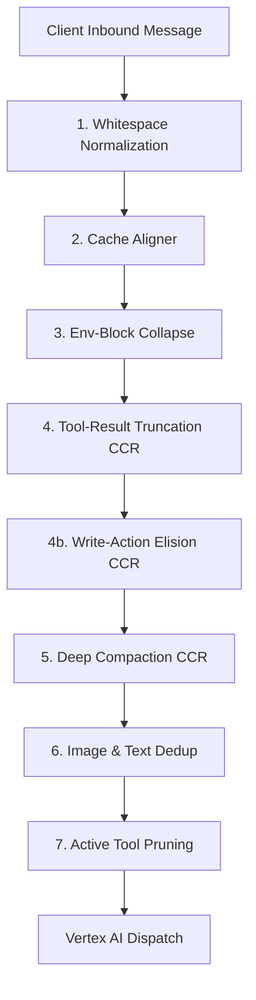

# Token-Cost Optimization Pipeline

`cline-vertex-gw` includes an intelligent, multi-stage **Token-Cost Optimization Pipeline** to dramatically shrink your context footprint and reduce upstream API billing.

In a standard benchmark conversation (such as a 5-turn Cline session with repetitive 3 KB code pasting and 3 KB system environment blocks on every user turn), this pipeline produces an end-to-end **64% input byte-count reduction** on top of Google/Anthropic's native prompt caching.

---

## The Optimization Pipeline Flow

The optimization stages run sequentially on inbound client messages before they are translated and dispatched to the upstream publishers.



---

## Pipeline Stages Detail

### 1. Whitespace Normalization (`normalize`)
Reduces redundant whitespace, double carriage returns, and trailing empty lines from system or user messages. Compresses raw text sizes by up to 5-10% without affecting code syntax or instruction meaning.
- **Config Knob:** `GW_NORMALIZE_WHITESPACE` (default: `on`)

### 2. Prefix Cache Stabilization (CacheAligner)
Standard cloud LLM providers (like Anthropic Claude and Gemini) use **prefix-based prompt caching** (KV cache). If even a single character changes at the beginning of the prompt prefix, the entire downstream prompt cache is invalidated, causing full price charging and high processing latency.
- **Action:** This stage automatically parses your system prompt, isolates volatile runtime elements (e.g. `Current Date & Time: ...`, `Working Directory: ...`, session or request UUIDs), and relocates them to a dedicated section at the **very end of the system prompt (the suffix)**.
- **The Result:** The massive base of the prompt prefix (containing static tool schemas and system instructions) remains **100% identical and stable**, guaranteeing up to **90% prompt-cache hit rates** on Claude and Gemini.
- **Config Knob:** `GW_CACHE_ALIGNER` (default: `on`)

### 3. Environment Block Collapse (`envblocks`)
Development agents frequently paste in massive blocks of system environments (like environment variables or directory paths) to assess workspace states.
- **Action:** If an environment text block exceeds a configured byte threshold, the stage collapses it into a compact, standardized summary placeholder. It exempts the **latest user turn** from this collapse to ensure the model always sees the current workspace state.
- **Config Knobs:** `GW_COLLAPSE_ENV_BLOCKS` (default: `on`), `GW_COLLAPSE_ENV_MIN_BYTES` (default: `256`)

### 4. Lossless Compress-Cache-Retrieve (CCR) Loops
Traditional token context managers use "destructive" truncation—permanently pruning old conversation turns and terminal outputs when context thresholds are breached, which causes the model to "forget" details from early turns.

`cline-vertex-gw` overhauls this with **lossless Compress-Cache-Retrieve (CCR) loops**:
- **Truncation:** If a tool execution result (such as a massive compiler dump or a read file output) exceeds the configured limit, it is elided. A high-density placeholder is substituted carrying a unique cryptographic SHA-256 lookup hash.
- **Local Cache:** The complete raw text of the elided tool result is saved in a fast file-based local storage cache (`FSCache`).
- **Dynamic Retrieval Tool:** The gateway dynamically injects a local-only tool named `retrieve_elided_content` into the model's active tool schema.
- **Local Interception:** If the model needs to inspect the truncated file, it calls the `retrieve_elided_content` tool. The gateway intercepts this call locally inside its streaming loops, reads the file from `FSCache`, and returns it directly **without network roundtrips to Vertex AI**.

```
[Massive Tool Output] ──► [Elided Placeholder with SHA-256 Hash] ──► [Save in FSCache]
                                                                        │
[Model wants full file] ◄── [Intercepts retrieve_elided_content] ◄──────┘
```

- **Config Knobs:**
  - **Tool Truncation:** `GW_TOOL_RESULT_TRUNCATE` (default: `on`), `GW_TOOL_RESULT_MAX_BYTES` (default: `8000`)
  - **Progressive Retain Window:** `GW_TOOL_RESULT_RETAIN_WINDOW` (default: `3`). Applies mild middle-elision inside the window (retaining headers and trailers of logs) and aggressive complete masking (100% elision) for deep history outside of it.
  - **Write-Action Elision:** `GW_WRITE_ACTION_ELISION` (default: `on`). Aggressively elides large code write and modification payloads (such as `write_to_file` and `replace_in_file` calls) older than 2 turns to eliminate redundant file dumps in history.
  - **History Compaction:** `GW_DEEP_COMPACT` (default: `off`), `GW_DEEP_COMPACT_KEEP_TURNS` (default: `12`)

### 5. Image & Text Deduplication (`dedup`)
- **Image Dedup:** Development agents take screenshots on every turn. Sending identical images repeatedly causes massive context bloat. The gateway hashes images; trailing duplicate image inputs are replaced with lightweight textual references pointing to the past turn where the image was first introduced.
- **Text Substring Dedup:** Compares overlapping substrings in the conversation history and deduplicates redundant file pastes.
- **Config Knobs:** `GW_DEDUP_REPLAY` (default: `on`), `GW_DEDUP_SUBSTRING` (default: `off`)

### 6. Active Tool Pruning (`active_tool_pruning`)
As agent backends grow, they register dozens of complex schemas. Loading these schemas on every turn wastes active token space.
- **Action:** Keeps track of recent conversation logs and dynamically disables unused tool definitions from the model's active schema catalog, keeping the prompt footprint small.
- **Config Knobs:** `GW_ACTIVE_TOOL_PRUNING` (default: `off`), `GW_ACTIVE_TOOL_PRUNING_WINDOW` (default: `20`)

### 7. Runaway Loop Interception (`loopbreak`)
Protects against automated billing disasters if an agent enters an infinite recursive execution loop:
- **Action:** A sliding substring loop detector monitors streaming tokens with **zero heap allocations** on the hot streaming path.
- **Termination:** If an infinite repetition sequence is detected, the gateway cancels the upstream context immediately, truncates the stream, and emits a clean termination `finish_reason: length`.
- **Config Knobs:** `GW_BREAK_LOOP_TRAP` (default: `on`), `GW_LOOP_TRAP_NUDGE` (default: `on`)
