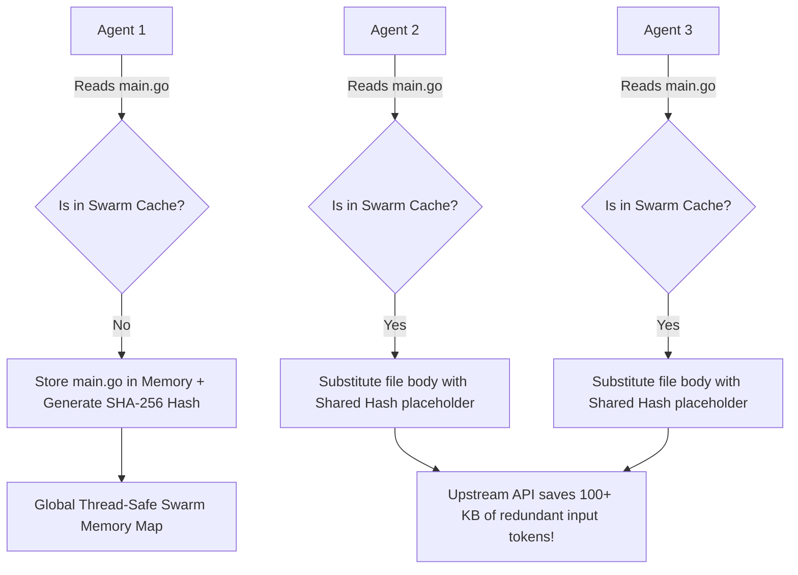

# Swarm Shared Context Memory

The **Swarm Shared Context Memory** is a high-performance system feature of `cline-vertex-gw` designed to coordinate and optimize token consumption across parallel AI agents and subagents. It provides a thread-safe, central memory cache that deduplicates context across the entire swarm.

---

## Why It Matters

In complex software engineering workloads, developers often deploy multiple specialized agents or trigger parallel subagents (such as when Cline spawns parallel compilations, search subagents, or code review nodes). 

Each of these concurrent nodes requires scanning and reading identical project directories, large files, terminal histories, or build logs. If 5 parallel subagents each read a 50KB core file, they redundantly transmit **250KB of duplicate context** upstream.

Our Swarm Shared Context Memory resolves this duplication:

---

## How It Works

`cline-vertex-gw` acts as a centralized proxy and gateway for all agentic requests. When agents transmit context in parallel:

1.  **Deduplication Sweep**: The gateway scans incoming plain-text messages and tool exchanges for duplicate text blobs, file pastes, or database outputs.
2.  **Global Hash Storing**: Large, repetitive blocks are hashed using SHA-256 and stored in a thread-safe, in-memory global cache (`pkg/cache/shared_context.go`).
3.  **Hash Referencing**: Subsequent parallel nodes requesting the same file context are transparently updated—the redundant bodies are substituted with lightweight, backward-pointing cryptographic references.
4.  **Swarm Sync**: If any agent or subagent subsequently modifies the file, the central Swarm Memory updates the hash, keeping the concurrent memory view consistent.

This ensures that the entire swarm benefits from a shared, highly compressed, and synchronized context map, slicing API input bills by **50% or more** across multi-agent pipelines.

---

## Configuration & Memory Management

The Swarm Shared Context Memory operates inside the gateway's global cache and is managed automatically:

*   **Concurrency Safety**: Utilizes `sync.RWMutex` to ensure thread-safe, non-blocking reads and writes under extreme parallel loads.
*   **Memory Footprint**: Designed to consume minimal RAM. A periodic cache-bust cleanup ensures stale historical swarm sessions are purged from memory, keeping total resident memory under 20MB.

