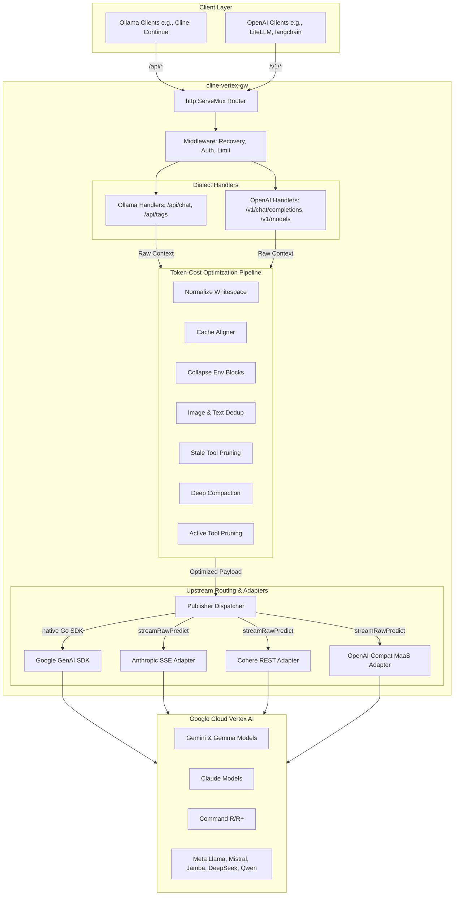

# cline-vertex-gw

Welcome to the official documentation for **`cline-vertex-gw`**!

`cline-vertex-gw` is an ultra-high-performance, production-grade, dual-surface translation proxy that connects Ollama-compatible and OpenAI-compatible clients to Google Cloud Vertex AI. 

Built specifically for high-frequency AI agent developer loops (such as Cline or Continue), the gateway implements an advanced, multi-stage **Token-Cost Optimization Pipeline** to dramatically shrink prompt contexts, maximize KV caching, detect and break LLM execution loops, and save up to **75% in upstream API costs**.

---

## Architectural Topology

The gateway acts as a stateless, low-latency translation proxy. It translates request/response shapes on-the-fly and streams responses dynamically over HTTP with zero added buffer delay.

---

## Core Pillars & Capabilities

### 1. Dual-Dialect Client Gating
- **Ollama Translation Surface (`/api/*`):** Seamless model discovery (`/api/tags`) and streaming chat completions (`/api/chat`). Acts as a drop-in local replacement for standard Ollama instances.
- **OpenAI Translation Surface (`/v1/*`):** Exposes `/v1/models` and `/v1/chat/completions` with bearer-token security. Integrates easily with LiteLLM, Continue, and LangChain.

### 2. Intelligent Context Optimization
The gateway runs a multi-stage, in-flight pipeline to trim input and output tokens before calling Google Cloud Vertex AI:
- **Prefix Cache Stabilization (CacheAligner):** Relocates volatile strings (e.g. dynamic date/time, working paths, session IDs) from system prompts to system prompt suffixes, stabilizing the static instruction/tool prefix and yielding up to **90% prompt caching hit rates** on Claude/Gemini.
- **Whitespace & Format Normalization:** Compacts redundant formatting in raw file pasted contents or code blocks.
- **Lossless Compress-Cache-Retrieve (CCR) Loops:** Substitutes elided terminal outputs with SHA-256 placeholder hashes, caching the raw content locally in `FSCache`. Dynamically injects a local `retrieve_elided_content` tool that lets the model retrieve truncated historical files on-demand without network roundtrips.
- **Runaway Loop Interception:** Instantly cancels upstream contexts if a model gets stuck in an infinite tool-calling loop, truncating costs.

### 3. Comprehensive Media & Tool Calling Translation
- **Magic-Bytes Sniffer:** Sniffs base64 streams (PNG, JPEG, GIF, WebP, PDF, WAV, MP3, MP4, etc.) to determine MIME types without client hints.
- **Robust Tool Translation:** Standardizes dynamic client tool formats to upstream specifications (such as Anthropic Messages, Cohere flattening, and Gemini Function Declarations) and streams back standardized chunks.

### 4. Enterprise-Grade Observability
- **Prometheus Metrics (`GET /metrics`):** Exports latency histograms, compression bytes saved, and loop-detector trigger states.
- **Live Billing Catalog Scraper:** Queries GCP's Cloud Billing Catalog API to automatically pull active rates, logging exact estimated USD costs per request in real-time.

---

## Navigation Guide

To explore the details of `cline-vertex-gw`, use the following navigation paths:

- **[Quick Start](quickstart.md):** Get the gateway compiled, running, and connected to your IDE in 5 minutes.
- **[Configuration Manual](configuration.md):** Full list of server knobs, optimization profiles (`GW_PROFILE`), and authentication variables.
  - **[Features]:** Deep technical analyses of the gateway's core systems:
    - **[Multimodal Support](features/multimodal.md):** Supported MIME types, magic-bytes sniffing, and media deduplication.
    - **[Tool Calling](features/tool_calling.md):** Translating and stream-assembling function schemas and tool executions.
    - **[Prometheus Metrics](features/metrics.md):** Metric schemas, hand-rolled telemetry endpoints, and active logger outputs.
    - **[Cost Estimation](features/cost_estimation.md):** Dynamic price catalog scraping, estimated cost resolution, and routing tiers.
    - **[Token-Cost Optimization](features/optimization.md):** Concrete overview of the 12+ prompt compaction stages and CCR loops.
- **[API Reference](api_reference.md):** Fully documented HTTP paths, request payloads, and response structures for Ollama and OpenAI dialects.
- **[Development Guide](development.md):** Compile binaries, run test blocks with race-detection, and understand the GitHub Actions CI/CD pipelines.
