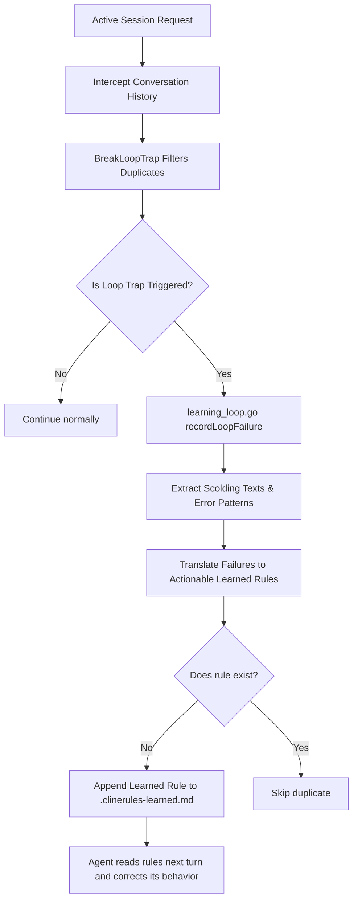

# Self-Healed Learning Loop

The **Self-Healed Learning Loop** is an advanced, persistent failure miner and autonomous correction agent. It dynamically identifies repetitive failures, scolding loops, or developer tool mistakes in active sessions and compiles structured, self-healing rule files to permanently optimize the agent.

---

## The Self-Healing Lifecycle

When an AI coding assistant (like Cline, Cursor, or Aider) gets stuck in a repetitive loop, it repeatedly hits the same roadblocks. A common example is the "no tool call scolding loop," where the client keeps telling the model: *"You did not use a tool in your previous response! Please call a tool."*

Our learning loop intercepts this sequence and breaks the cycle:

### 1. Loop-Trap Detection
The gateway's `BreakLoopTrap` scans user/assistant turns. If it identifies that duplicate, automated client scoldings or empty turns are clogging up the context, it activates the learning loop.

### 2. Failure Pattern Mining
The learning loop parses the text of the scolding turns. It analyzes specific substrings and maps them to generalized, high-level structural operational rules:
- **No-Tool Scolding**: If the scolding is about missing tool calls, it writes: *"When given tasks, always call relevant tools instead of outputting conversational text alone."*
- **Endless Retries**: If the scolding is about getting stuck or loop traps, it writes: *"If you find yourself stuck in a loop repeating actions, pivot to checking environment state or logs."*
- **Checklist Overlooks**: If the scolding is about task progress lists, it writes: *"Make sure to update the task checklists and tick off completed subtasks to maintain alignment."*
- **Terminal Execution Failures**: If the scolding is about command-line exits, it writes: *"If a shell command fails, inspect the configuration files or error traces first before retrying the same command."*

### 3. Rule Ledger Persistence
The compiled lessons are automatically formatted and appended with a live timestamp to **`.clinerules-learned.md`** under the project workspace root.

On subsequent requests or turns, when the AI agent scans the project's workspace files (or reads `.clinerules`), it immediately discovers these newly compiled, context-specific guidelines. This helps the assistant correct its behavior and break the loop trap autonomously.

---

## Configuration & Profile Defaults

*   **Master Switch**: `GW_LEARNING_LOOP` (or `learningLoopEnabled`)
*   **Gradient Profile Baselines**:
    *   **Profile 1 (Pass-Through)**: `false`
    *   **Profile 2 (Gentle)**: `false`
    *   **Profile 3 (Balanced - Default)**: `false` (to ensure the default profile does not perform persistent disk writes to `.clinerules-learned.md`)
    *   **Profile 4 (Aggressive)**: `false` (reserved for extreme autonomous profiles)
    *   **Profile 5 (Extreme Squeeze)**: `true` (fully activates the experimental self-healing learning engine)
