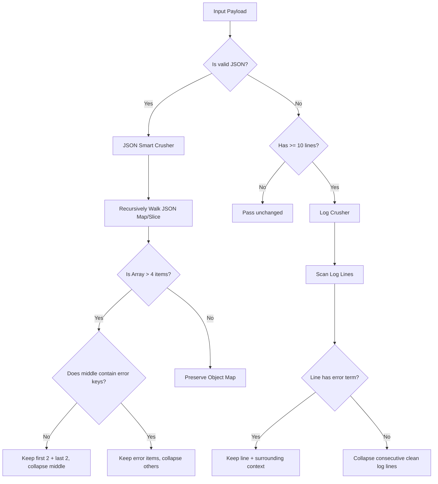

# Smart JSON & Structured Log Crusher

The **Smart JSON & Structured Log Crusher** is a lossless, structure-aware compression stage designed to dynamically reduce the token size of heavy structured datasets (like large JSON payloads, database outputs, and command line console/server logs) in historical conversation turns.

## How It Works

Instead of blindly truncating or cutting characters from a large structured text block (which can break JSON syntax or discard critical error traces), the Smart Crusher parses and processes the payload according to its format:



### 1. JSON Array Collapsing
When the crusher identifies a JSON array with more than 4 elements:
- It preserves the **first 2** elements (typically defining schema and start state) and the **last 2** elements (defining trailing result state).
- It collapses the middle elements into a single placeholder string: `"/* elided N items */"`.
- If a nested object in the middle of the array contains error keys, failures, or non-zero statuses, the crusher **automatically fishes it out** and preserves it verbatim, collapsing only the surrounding clean items.

### 2. Error-Prioritized Log Crushing
When the crusher handles standard non-JSON terminal or execution logs with 10 or more lines:
- It preserves the first 3 lines (command invocation, environment headers) and the last 3 lines (execution summary, exit codes).
- It performs an in-depth keyword sweep across all middle lines looking for critical failures (`ERROR`, `Exception`, `failed`, `stderr`, `FATAL`, `panic`, `traceback`, `exit status`).
- If any line contains an error term, it preserves that line **plus its immediate preceding and succeeding context lines** to ensure the model retains full visibility of the error trace.
- Consecutive blocks of clean log lines are collapsed into a single marker line: `... [elided N clean log lines. Retrieve full content: hash=...] ...`.

---

## Lossless Recovery via CCR

Before any payload is compressed or crushed, its full, raw, uncompacted content is hashed via SHA-256 and stored in the gateway's fast `FSCache`. 

The Smart Crusher prepends and appends explicit metadata tags to the crushed payload, embedding the cryptographic hash:
```
/* [JSON COMPRESSED - original cached with hash=f83a... Use retrieve_elided_content if needed] */
```

If the LLM determines it needs to see the full, raw output (e.g. to inspect a specific item that was elided), it can dynamically call the `retrieve_elided_content` tool to read the uncompressed data from the gateway's cache in under 1ms.

---

## Configuration & Profile Defaults

*   **Master Switch**: `GW_SMART_CRUSHER` (or `smartCrusherEnabled`)
*   **Gradient Profile Baselines**:
    *   **Profile 1 (Pass-Through)**: `false`
    *   **Profile 2 (Gentle)**: `false`
    *   **Profile 3 (Balanced - Default)**: `true`
    *   **Profile 4 (Aggressive)**: `true`
    *   **Profile 5 (Extreme Squeeze)**: `true`
