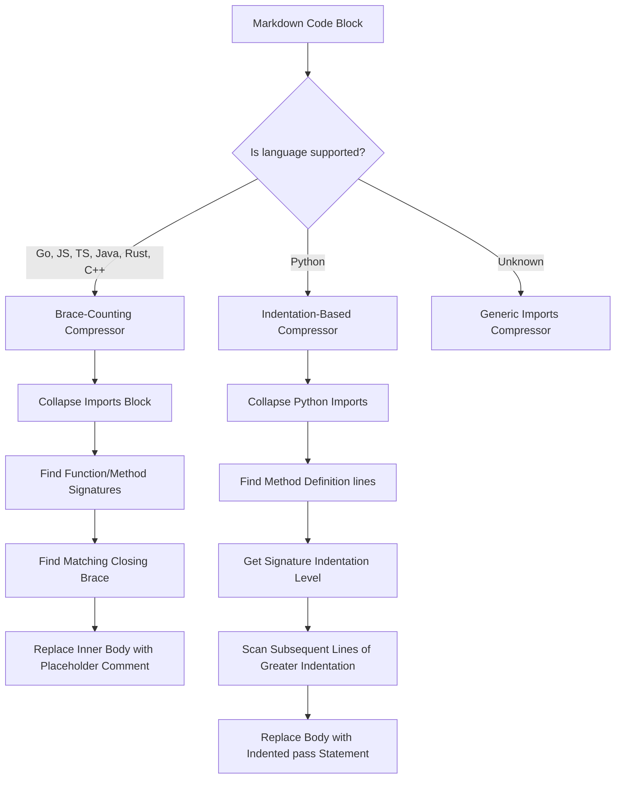

# Lightweight Syntactic Code Compressor

The **Lightweight Syntactic Code Compressor** is an advanced, structure-aware source-code optimizer. It parses and compresses source files and code blocks inside historical conversation turns, preserving function signatures and structural type definitions while dropping function/method bodies.

This achieves a massive 50–80% reduction in source code context without losing the model's structural understanding of imports, classes, methods, or type definitions.

---

## How It Works

Traditional context reduction stages use character-level or byte-level progressive middle-elision, which blindly slices through the middle of files, breaking syntax, corrupting braces, and confusing compilers.

Our Syntactic Code Compressor runs custom, high-speed Go regex-and-rules engines designed for popular programming languages:



### 1. Go & Brace-Based Languages (`Go`, `JS`, `TS`, `Java`, `Rust`, `C++`)
- **Imports Collapsing**: Matches standard import blocks (such as `import (...)` in Go) and collapses them to a single-line block: `import ( /* collapsed imports (retrieve_elided_content) */ )`.
- **Brace-Counting Body Squeezer**:
  - Automatically identifies function/method signatures ending with an opening brace `{` (such as `func ProcessData(x int) (string, error) {` or `public void run() {`).
  - Implements a fast, zero-dependency brace-matching scanner. It tracks `{` and `}` braces sequentially starting from the function signature to pinpoint the exact matching closing brace `}`.
  - Replaces the code statements *inside* the braces with a single placeholder comment: `/* body elided (retrieve_elided_content: hash=...) */`.
  - **Syntactic Safety**: Because braces remain perfectly balanced, the resulting file is structurally valid. It preserves the exact names, argument lists, return types, and schemas of all methods.

### 2. Python Indentation-Based Compressor
- **Imports Collapsing**: Collapses contiguous import lines to `import ... # collapsed python imports (retrieve_elided_content)`.
- **Indentation Body Squeezer**:
  - Matches method declarations starting with `def ` (such as `def run_calculation(self):`).
  - Measures the exact leading spaces/tabs indentation level of the definition line.
  - Scans all subsequent lines. Any lines that have a *strictly greater* indentation level (ignoring blank lines and comments) are identified as the method's body.
  - Replaces those body lines with a single, syntactically correct python placeholder: `[indent]pass # body elided (retrieve_elided_content: hash=...)`.
  - **Class Preservation**: It intentionally skips `class` definitions, allowing class names and structure to remain intact while only collapsing the internal methods.

---

## Lossless Recovery via CCR

Before a code block is compressed, its original uncompacted code is stored in the gateway's `FSCache`.

A comment marker containing the cryptographic hash is prepended to the code block:
```go
// [SYNTAX COMPRESSED - original cached with hash=f83a... Use retrieve_elided_content if needed]
```

If the LLM needs to inspect the implementation of any elided helper function to understand details or modify it, it can dynamically call the `retrieve_elided_content` tool to fetch the original code in under 1ms from the local cache.

---

## Configuration & Profile Defaults

*   **Master Switch**: `GW_SYNTAX_COMPRESSOR` (or `syntaxCompressorEnabled`)
*   **Gradient Profile Baselines**:
    *   **Profile 1 (Pass-Through)**: `false`
    *   **Profile 2 (Gentle)**: `false`
    *   **Profile 3 (Balanced - Default)**: `false` (to keep the default profile completely safe and avoid any syntactic alterations of source code blocks)
    *   **Profile 4 (Aggressive)**: `true` (running inside historical deep compaction)
    *   **Profile 5 (Extreme Squeeze)**: `true`
